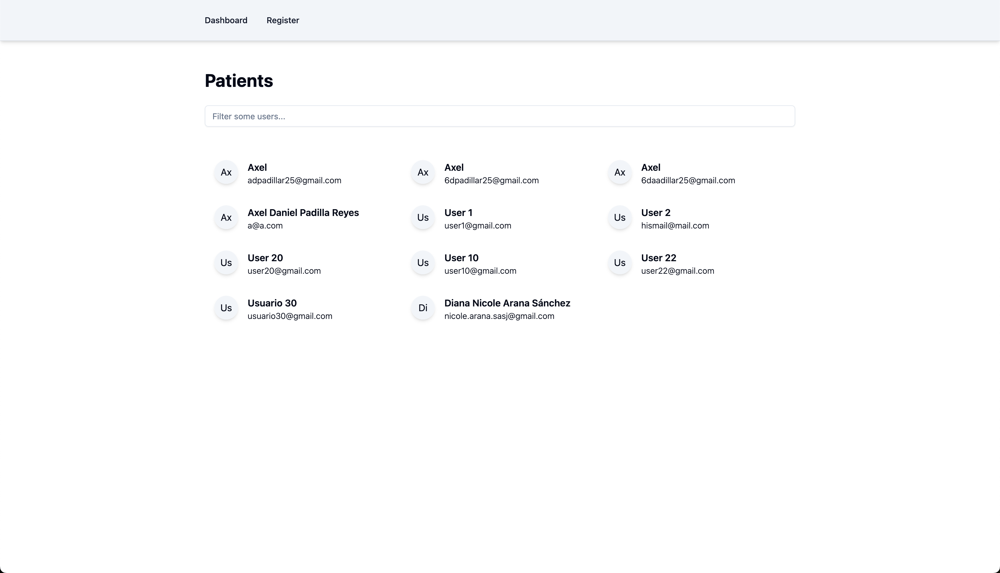
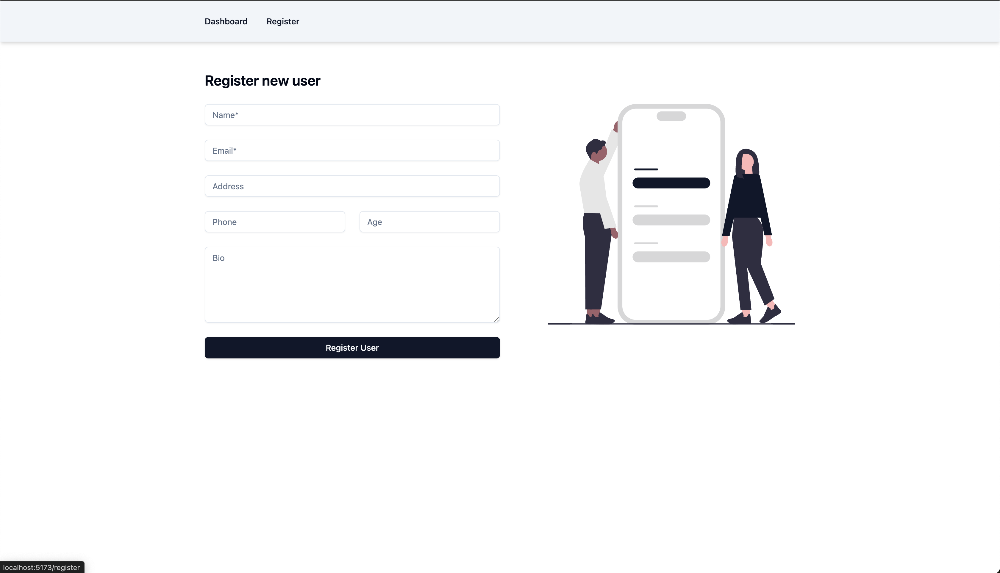
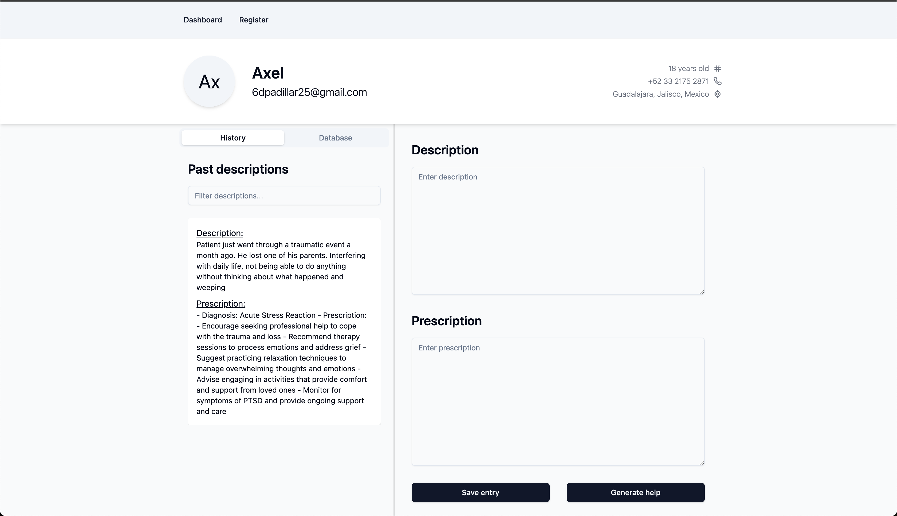
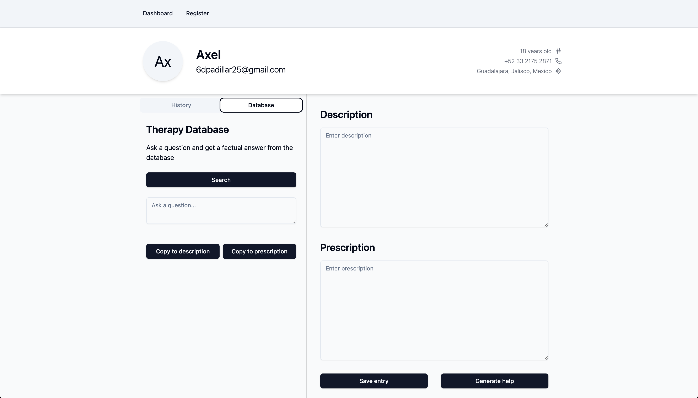

## Examen user-integration

Axel Daniel Padilla Reyes
A01642700

### To run the project

- On the client react app, run `npm start`
- On the server node app, run `npm start`

Open [http://localhost:5173](http://localhost:5173) to view it in the browser.

### Evidence

1. Dashboard

2. Register

3. Details

4. RAG

